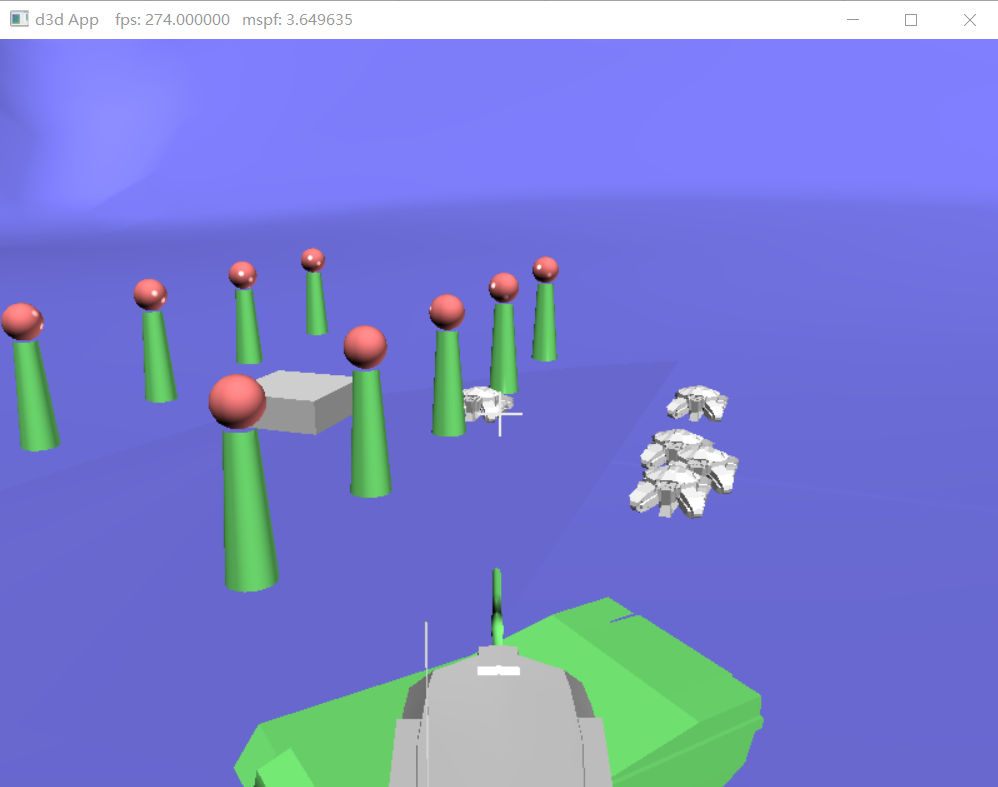
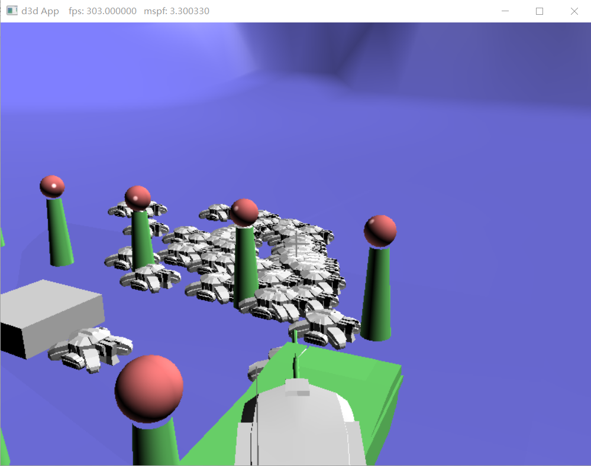
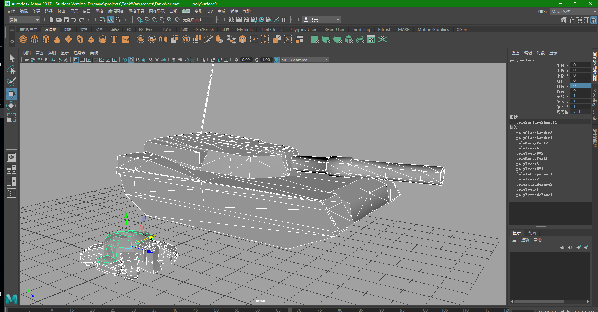

这是我在阅读《Introduction to 3D Game Programming with DirectX12 》到第8章的时候写的一个小游戏Demo。

## 玩法
玩家操作一辆坦克，wasd控制坦克的方向，按右键发射炮弹，按左键生成小坦克。
小坦克会不停的向玩家靠近，这个游戏并不完整，只有基本的操作控制，没有**得分**和**死亡**的概念。

游戏截图：

### 在写这个游戏的时候尝试了很多新的知识
比如：
* 分析obj格式文件，从中加载模型网格。
* 联动的骨骼，例如玩家控制的坦克的炮台以及其上方的摄像机都是由一连串的骨骼来控制的，这个骨骼系统可以用于游戏中任何物体的运动。
* 预先内存分配，每一个对象内存都是在游戏开始的时候分配好了的，使用双向循环链表来存储这些对象，当按右键生成对象的时候，由统一的全局控制对象（PawnMaster）管理这些对象的生成和销毁。
* 简易的AI，特意编写了一个AI控制对象，可以为每个AI对象定义动作，程序员可以定义多个片段，然后每一个片段执行一段代码，每个片段的末尾指定到另一个片段的可能性是多大，AI控制对象会自动选取相应的片段代码去执行。
* 使用射线碰撞来检查炮弹与**小**坦克的碰撞，一旦碰撞，就会通知PawnMaster销毁相应的对象。并且为了加快射线碰撞的检测速度，首先用一个包围球来判断和射线的距离，避免没有相撞的情况，提高运行速度读。

### 自己制作模的模型：

